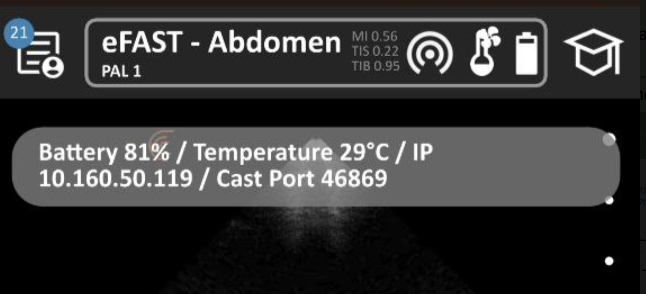

# clarius_ros2
This is a ROS2 wrapper for the Clarius ultrasound devices. Currenlty, the wrapper publishes the ultrasound image on a ROS2 topic and provides a service to start and stop the ultrasound stream. New features will be added in the future to port all the Clarius API functionalities to ROS2 using topics and services.
## Supported Devices
Every devices that is supported by the Clarius Cast API should work with this wrapper. To be able to use the wrapper you need the buy the [Clarius Research Toolkit](https://clarius.com/scanners/research/).
## Tested platforms
- Ubuntu 22.04
- ROS2 Humble
## Installation
1. Clone the repository into your ROS2 workspace:
```bash
cd <your_ros2_workspace>/src
git clone git@github.com:Hydran00/clarius_ros2.git
```
2. Build your workspace
```bash
cd <your_ros2_workspace>
colcon build --symlink-install
```
## Run the wrapper
To run the application ensure that all the following devices are under the same local network:
 - the Clarius ultrasound scanner
 - the device running the Clarius app
 - the computer running this application.

1. Source your workspace
```bash
source <your_ros2_workspace>/install/setup.bash
```
2. Retrieve your `ip_address` and `port` of your US scanner by tapping on the battery indicator and set them in the launch file `us_stream.launch.py`
    
    <center></center>
    
    ```
        # Set your local ip address and port here in us_stream.launch.py
        Node(
            package="clarius_ros2",
            executable="clarius_wrapper",
            output="screen",
            # passing the argument to the node
            parameters=[
                {"us_image_topic_name": "test"},
                {"frame_id": "clarius_probe"},
                {"ip_address": "10.160.50.119 "}, # <- set your local ip address here
                {"port": 46869}, # <- set your local port here
            ],
        ),
    ```
3. Run the wrapper
```bash
ros2 launch clarius_ros2 us_stream.launch.py us_image_topic_name:=us_image
```
4. check the image topic in Rviz and available services with `ros2 service list`